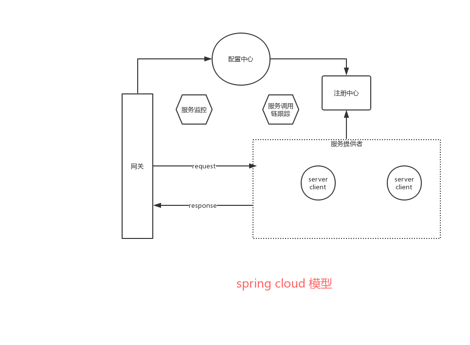

# Spring Cloud Project

## 目的
* 学到的知识,让他人能够快速的上手
* 写代码或者文章一定要自身足够清楚每一行代码和配置在写出来,否则会让他人产生质疑

## 技术栈
版本bom 特别要注重版本意识
```xml
        <spring-boot.version>2.0.2.RELEASE</spring-boot.version>
        <spring-cloud.version>Finchley.RC2</spring-cloud.version>
```


## 搭建模型
