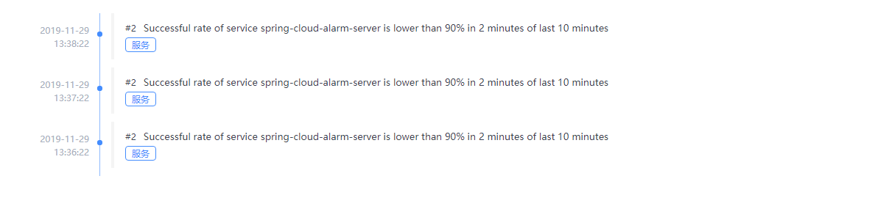
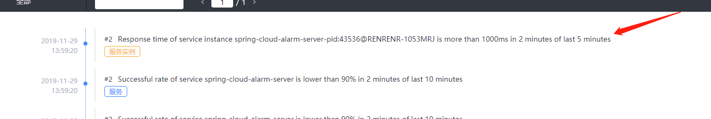
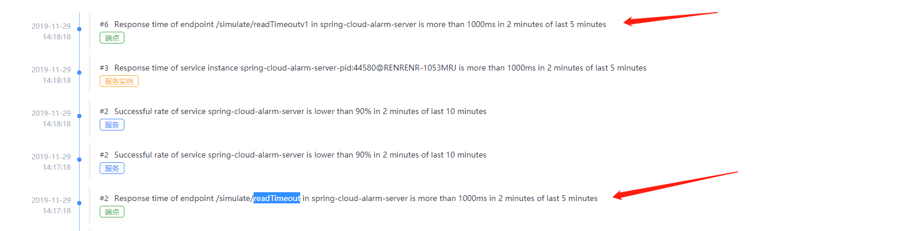

# Spring Cloud Skywalking 

## 无侵入调用链埋点框架

## Download...
先跑起来,后了解原理，然后业务上不满足时在进行插件开发

## 辅助工具
postman串行设置请求数,达到模拟效果(工具随便选择)

## agent接入环境
-javaagent:D:\qijia-java\apm\apache-skywalking-apm-bin\agent\skywalking-agent.jar=agent.service_name=spring-cloud-alarm-server

## 回调地址
    webhooks:
      - http://127.0.0.1:8099/alarm/notify
## 监控范围粒度
    服务<服务实例<端点

## 常见问题
1. 告警消息不支持中文,存在乱码问题,故服务中做了个报警规则中文转换

## 告警配置
1. 时间窗口为5分钟,在连续的两分钟内计数两个时触发警报, silence-period静默周期为0，接下来时间内一旦满足条件一直发送告警
如果 silence-period = threshold,会跳过该时间内

http://127.0.0.1:8099/simulate/readTimeout
```yaml
  service_resp_time_rule:
    metrics-name: service_resp_time
    op: ">"
    threshold: 2000
    period: 5
    count: 2
    silence-period: 0
    message: The average service response event in the last 2 minutes is greater than 2 seconds
```
页面告警


邮箱告警


2. 时间窗口为10分钟,在连续的两分钟内如果服务请求的成功率低于%90触发警报,后续描述和第一个相同

http://127.0.0.1:8099/simulate/error

```yaml
  service_sla_rule:
    metrics-name: service_sla
    op: "<"
    threshold: 9000
    period: 10
    count: 2
    silence-period: 0
    message: Successful rate of service {name} is lower than 90% in 2 minutes of last 10 minutes
```
页面告警


邮箱告警

3. 时间窗口为5分钟,在连续的两分钟内如果服务实例平均请求响应大于1秒告警,后续描述和第一个相同(范围在实例上比在服务上控制力度更细,可以具体看到
那个实例出问题)

http://127.0.0.1:8099/simulate/readTimeout

```yaml
  service_instance_resp_time_rule:
    metrics-name: service_instance_resp_time
    op: ">"
    threshold: 1000
    period: 5
    count: 2
    silence-period: 0
    message: Response time of service instance {name} is more than 1000ms in 2 minutes of last 5 minutes
```
页面告警


邮箱告警

4. 时间窗口为5分钟,在连续的两分钟内如果端点平均请求响应大于1秒告警,后续描述和第一个相同(范围在实例上比在服务上控制力度更细,可以具体看到
那个实例出问题)

http://127.0.0.1:8099/simulate/readTimeout
http://127.0.0.1:8099/simulate/readTimeoutv1
```yaml
  endpoint_avg_rule:
    metrics-name: endpoint_avg
    op: ">"
    threshold: 1000
    period: 5
    count: 2
    silence-period: 5
    message: Response time of endpoint {name} is more than 1000ms in 2 minutes of last 5 minutes
```
页面告警


邮箱告警


## 演示配置


## 参考文章
https://github.com/apache/skywalking/blob/master/docs/en/concepts-and-designs/scope-definitions.md

https://github.com/apache/skywalking/blob/master/docs/en/setup/backend/backend-alarm.md#list-of-all-potential-metrics-name

https://github.com/apache/skywalking/blob/master/docs/en/protocols/README.md#query-protocol


