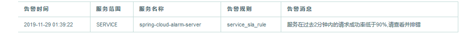
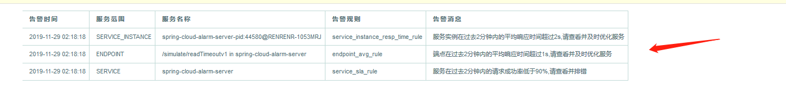

# Spring Cloud Skywalking 接入指南

## 无侵入调用链埋点框架

## Download...
先跑起来,后了解原理，然后业务上不满足时在进行插件开发[http://skywalking.apache.org/downloads/]


## 辅助工具
postman串行设置请求数,达到模拟效果(工具随便选择)

## agent接入环境
* 配置信息外部化配置
    1. jar应用:-javaagent:/path/to/skywalking-agent.jar=[option1]=[value1],[option2]=[value2]
    2. tomcat: set "CATALINA_OPTS=-javaagent:/path/to/skywalking-agent/skywalking-agent.jar=[option1]=[value1],[option2]=[value2]"
    3. 例子: -javaagent:D:\qijia-framework\apm\apache-skywalking-apm-bin\agent\skywalking-agent.jar=agent.service_name=spring-cloud-alarm-server,collector.backend_service=127.0.0.1:11800
* 指定配置文件路径，项目和配置文件一对一
    1. -Dskywalking_config=/path/to/agent.config
    2. -Dskywalking_config=D:\agent.config
* 可选插件
    1. apm-trace-ignore-plugin->排除不需要监控路径,比如eureka客户端心跳等等
    2. 其他可选插件参考官方文档
* 注意事项
    1. 多个项目共用一个agent时,日志文件路径[logging.dir]要区分,便于排除问题
    2. 项目和agent为1对1时,请注意agent命名空间[agent.namespace],当双方使用不同的名称空间时，跨进程传播链中断。
    3. docker环境采用数据卷[VOLUME]方式docker run -v 主机路径:容器路径(不建议每个应用都把agent打在镜像去启动,这样的话感觉资源有些浪费)

## 回调地址
    webhooks:
      - http://127.0.0.1:8099/alarm/notify
      
## 其他配置
    doc/readme/
## 监控范围粒度
    服务<服务实例<端点

## 常见问题
1. 告警消息不支持中文,存在乱码问题,故服务中做了个报警规则中文转换

## 告警配置
一. 时间窗口为5分钟,在连续的两分钟内计数两个时触发警报, silence-period静默周期为0，接下来时间内一旦满足条件一直发送告警
如果 silence-period = threshold,会跳过该时间内

http://127.0.0.1:8099/simulate/readTimeout
```yaml
  service_resp_time_rule:
    metrics-name: service_resp_time
    op: ">"
    threshold: 2000
    period: 5
    count: 2
    silence-period: 0
    message: The average service response event in the last 2 minutes is greater than 2 seconds
```
页面告警


邮箱告警


二. 时间窗口为10分钟,在连续的两分钟内如果服务请求的成功率低于%90触发警报

http://127.0.0.1:8099/simulate/error

```yaml
  service_sla_rule:
    metrics-name: service_sla
    op: "<"
    threshold: 9000
    period: 10
    count: 2
    silence-period: 0
    message: Successful rate of service {name} is lower than 90% in 2 minutes of last 10 minutes
```
页面告警


邮箱告警


三. 时间窗口为5分钟,在连续的两分钟内如果服务实例平均请求响应大于1秒告警
那个实例出问题)

http://127.0.0.1:8099/simulate/readTimeout

```yaml
  service_instance_resp_time_rule:
    metrics-name: service_instance_resp_time
    op: ">"
    threshold: 1000
    period: 5
    count: 2
    silence-period: 0
    message: Response time of service instance {name} is more than 1000ms in 2 minutes of last 5 minutes
```
页面告警


邮箱告警

四. 时间窗口为5分钟,在连续的两分钟内如果端点平均请求响应大于1秒告警
那个实例出问题)

http://127.0.0.1:8099/simulate/readTimeout
http://127.0.0.1:8099/simulate/readTimeoutv1
```yaml
  endpoint_avg_rule:
    metrics-name: endpoint_avg
    op: ">"
    threshold: 1000
    period: 5
    count: 2
    silence-period: 5
    message: Response time of endpoint {name} is more than 1000ms in 2 minutes of last 5 minutes
```
页面告警


邮箱告警



## 演示配置


## 参考文章
    告警脚本规则
    https://github.com/apache/skywalking/blob/master/docs/en/concepts-and-designs/scope-definitions.md
    
    https://github.com/apache/skywalking/blob/master/docs/en/setup/backend/backend-alarm.md#list-of-all-potential-metrics-name
    
    https://github.com/apache/skywalking/blob/master/docs/en/protocols/README.md#query-protocol

    agent探针详细配置文档
    https://github.com/apache/skywalking/blob/master/docs/en/setup/service-agent/java-agent/README.md#optional-plugins
   
    社区中文文档
    https://skyapm.github.io/document-cn-translation-of-skywalking/
    
    官方演示地址
    [演示地址](http://122.112.182.72:8080/)
    官方演示demo
    [github_spring-cloud-example](https://github.com/SkyAPMTest/spring-cloud-example)
    
    
    [告警文章](https://blog.csdn.net/zhllansezhilian/article/details/88304332)
    
    ui展示參數介紹
    https://www.wandouip.com/t5i329072/
    

    


