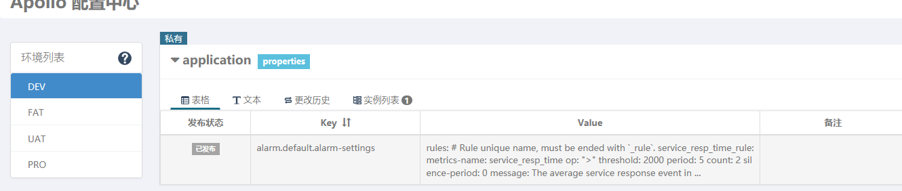

# Spring Cloud Skywalking 动态配置指南

## oap服务端重启后
* 客户端需配置 agent.cool_down_threshold=时间(单位)收到重置命令后多长时间重新连接oap服务端


## 动态配置(apollo)
```yaml
    configuration:
      none:
        apollo:
          apolloMeta: http://ip:9089
          apolloCluster: default
          apolloEnv: dev
          appId: skywalking-oap
          period: 5 #时间间隔
```
直接把alarm-settings.yml内容复制到value属性上



##参考文档

#### 动态配置告警
[AlarmRulesWatcher]
https://github.com/apache/skywalking/blob/master/docs/en/setup/backend/dynamic-config.md

#### 客户端心跳检测通信
[ServiceAndEndpointRegisterClient] 


